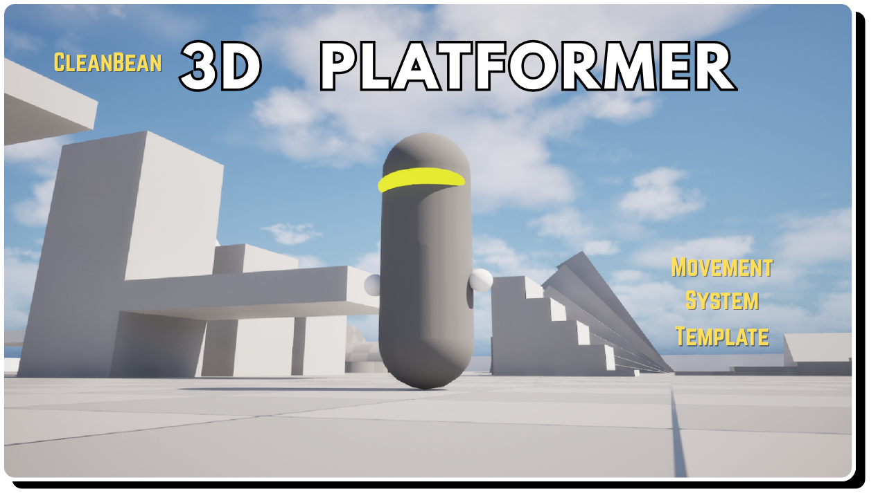

  <picture>
    
  </picture>

  <strong>A snappy, juice-packed 3D platformer controller for Unreal Engine.</strong> 

  Procedural animations. Punchy SFX. Particles on everything. No humanoid rig required.

  

  &nbsp;

  &nbsp;

  

  

 

  

<!-- [REPLACE: Add a GIF or screenshot showing your controller in action] -->

<!-- This is the single most important thing in your README. A 5-10 second GIF of the character running, jumping, and double jumping with the particles and lean visible will sell this better than any words. -->

<!-- 

 -->

  

---
## What is this?

A ready-to-use 3D platformer character controller built for Unreal Engine 5. It's designed around one principle: **movement should feel good.**

Just a simple bean character driven entirely by procedural animations — and it feels alive. The controller is snappy and responsive with just enough weight to feel grounded, paired with particles, screen-ready SFX, and visual feedback on every action.

---

  

## Features

  

🏃 **Movement** — Run, jump, and double jump with tight, responsive controls. Tuned for that instant-response feel with subtle acceleration curves that add weight without lag.

  

🫘 **Clean Bean Character** — A clean capsule/bean mesh with no animation dependencies. Swap in your own model anytime — the procedural system works with any mesh.

  

🎭 **Procedural Animations** — Forward tilt on run. Directional lean on strafe. Squash on land, stretch on launch. All driven in real time by movement data, not canned clips.

  

✨ **Particles** — Jump bursts, land impacts scaled to fall distance, and subtle walk dust. Wired up and triggering automatically.

  

🔊 **Sound Effects** — Punchy jump and land SFX, rhythmic footsteps synced to speed. Designed to feel satisfying without being genre-locked.

  

⚙️ **Fully Configurable** — Every parameter is exposed in the Blueprint details panel: speed, gravity, jump force, lean angle, particle intensity, SFX volume, and more.

  

---

  

## Roadmap — What's Coming in v1.0

  

The current release (v0.5) covers core movement and juice. Version 1.0 will add advanced traversal:

  

| Feature | Description |

|---|---|

| **Wall Running** | Run along vertical surfaces with auto-detection and smooth transitions |

| **Wall Jumping** | Launch off walls with full directional control |

| **Vaulting** | Automatic vault over low obstacles |

| **Ground Slam** | Mid-air downward slam with impact VFX and camera shake |

| **Grinding** | Rail grinding with speed and balance mechanics |

  

> 💡 **Bought v0.5?** You'll receive all v1.0 features as a free update.

  

---

  

## 🎮 Playable Demo

  

Want to feel it before you buy it? Download the standalone demo build:

  

**➡️ [Download Demo (Windows)](https://github.com/YOUR-USERNAME/YOUR-REPO-NAME/releases/latest)**

  

<!-- [NOTE: Upload your packaged demo .zip to GitHub Releases] -->

  

> ⚠️ Windows SmartScreen may show a warning since this is an independently distributed build. Click **More info** → **Run anyway**. This is standard for indie-distributed software.

  

---

  

## 📄 Documentation

  

Full setup guide, feature breakdowns, configuration reference, and changelog:

  

**➡️ [Read the Documentation](https://YOUR-USERNAME.github.io/YOUR-REPO-NAME/assets/platformer-template/docs.html)**

  

---

  

## Quick Start

  

1. **Purchase** the asset on the [Fab Marketplace](https://www.fab.com)

2. **Install** it into your UE5 project via the launcher

3. **Open** the included example map to see it in action

4. **Drop** `BP_PlatformerCharacter` into your own level

5. **Set** it as the default pawn in your Game Mode

6. **Tune** the exposed parameters in the Details panel to fit your game

  

That's it. Full details in the [docs](https://YOUR-USERNAME.github.io/YOUR-REPO-NAME/assets/platformer-template/docs.html).

  

---

  

## Requirements

  

- Unreal Engine 5.3+

- No additional plugins

- Works with Blueprint-only or C++ projects

  

---

  

## Support

  

Having trouble? Found a bug? Want to say something nice?

  

- 📧 **Email:** [your@email.com](mailto:your@email.com)

- 💬 **Discord:** [Join the server](#)

- 🛒 **Fab:** Use the Questions tab on the [store listing](https://www.fab.com)

  

When reporting bugs, please include your UE version, what happened, and steps to reproduce. Screenshots or clips help a lot.

  

---

  

  Built with ☕ by <strong>[YOUR STUDIO NAME]</strong> 

  © 2026 [YOUR STUDIO NAME]. All rights reserved. See <a href="LICENSE">LICENSE</a> for details.

